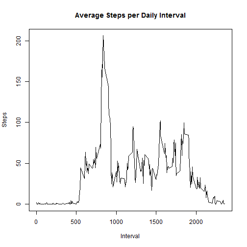

# Course Project 1 - Reproducible Research

## Loading and Processing Data

The following commands will:

1. Load the data

2. Process and transforms the data into a format suitable for analysis

Note that no adjustments have been made to NA values yet.


```r
data <- read.csv("activity.csv")
```


## What is mean total number of steps taken per day?

The following commands will:

1. Calculate the total number of steps taken per day by creating another table *data_per_day*

```r
data_per_day <- aggregate(data$steps, by=list(Date=data$date), FUN=sum)
data_per_day
```

```
##          Date     x
## 1  2012-10-01    NA
## 2  2012-10-02   126
## 3  2012-10-03 11352
## 4  2012-10-04 12116
## 5  2012-10-05 13294
## 6  2012-10-06 15420
## 7  2012-10-07 11015
## 8  2012-10-08    NA
## 9  2012-10-09 12811
## 10 2012-10-10  9900
## 11 2012-10-11 10304
## 12 2012-10-12 17382
## 13 2012-10-13 12426
## 14 2012-10-14 15098
## 15 2012-10-15 10139
## 16 2012-10-16 15084
## 17 2012-10-17 13452
## 18 2012-10-18 10056
## 19 2012-10-19 11829
## 20 2012-10-20 10395
## 21 2012-10-21  8821
## 22 2012-10-22 13460
## 23 2012-10-23  8918
## 24 2012-10-24  8355
## 25 2012-10-25  2492
## 26 2012-10-26  6778
## 27 2012-10-27 10119
## 28 2012-10-28 11458
## 29 2012-10-29  5018
## 30 2012-10-30  9819
## 31 2012-10-31 15414
## 32 2012-11-01    NA
## 33 2012-11-02 10600
## 34 2012-11-03 10571
## 35 2012-11-04    NA
## 36 2012-11-05 10439
## 37 2012-11-06  8334
## 38 2012-11-07 12883
## 39 2012-11-08  3219
## 40 2012-11-09    NA
## 41 2012-11-10    NA
## 42 2012-11-11 12608
## 43 2012-11-12 10765
## 44 2012-11-13  7336
## 45 2012-11-14    NA
## 46 2012-11-15    41
## 47 2012-11-16  5441
## 48 2012-11-17 14339
## 49 2012-11-18 15110
## 50 2012-11-19  8841
## 51 2012-11-20  4472
## 52 2012-11-21 12787
## 53 2012-11-22 20427
## 54 2012-11-23 21194
## 55 2012-11-24 14478
## 56 2012-11-25 11834
## 57 2012-11-26 11162
## 58 2012-11-27 13646
## 59 2012-11-28 10183
## 60 2012-11-29  7047
## 61 2012-11-30    NA
```

2. Make a histogram of the total number of steps taken each day using the new data.frame created above

```r
hist(data_per_day$x, xlab="Steps", main="Steps per Day")
```


3. Calculate the mean and median of the total number of steps taken per day

```r
mean(data_per_day$x, na.rm=TRUE)
```

```
## [1] 10766.19
```

```r
median(data_per_day$x, na.rm=TRUE)
```

```
## [1] 10765
```

Note that no adjustments have been made to NA values yet.


## What is the average daily activity pattern?

The following commands will:

1. Make a time series plot of the 5-minute interval (x-axis) and the average number of steps taken, averaged across all days (y-axis)

```r
data_per_interval <- aggregate(data$steps, by=list(Interval=data$interval), FUN=mean, na.rm=TRUE)
plot(data_per_interval$Interval,data_per_interval$x, type = "l", main="Average Steps per Daily Interval", xlab="Interval", ylab="Steps")
```



2. Determine which 5-minute interval, on average across all the days in the dataset, contains the maximum number of steps.

```r
data_per_interval[which.max(data_per_interval$x),]
```

```
##     Interval        x
## 104      835 206.1698
```
ie. 8:35am had the most average steps

Note that no adjustments have been made to NA values yet.


## Imputing missing values

There are a number of days/intervals where there are missing values (coded as NA). The presence of missing days may introduce bias into some calculations or summaries of the data.

The following commands will:

1. Calculate and report the total number of missing values in the dataset (i.e. the total number of rows with NAs)

```r
sum(is.na(data$steps))
```

```
## [1] 2304
```

2. In order to fill in all of the missing values in the dataset, one strategy would be to set the NAs equal to the mean for that 5-minute interval across all other days

3. Create a new dataset that is equal to the original dataset but with the missing data filled in.

```r
data2 <- merge(data, data_per_interval, by.x="interval", by.y="Interval")
is_nas <- is.na(data2$steps)
data2$steps[is_nas] <- data2$x[is_nas]
```
Check NAs:

```r
sum(is.na(data2$steps))
```

```
## [1] 0
```

4. Make a histogram of the total number of steps taken each day and Calculate and report the mean and median total number of steps taken per day. Do these values differ from the estimates from the first part of the assignment? What is the impact of imputing missing data on the estimates of the total daily number of steps?

```r
data2_per_day <- aggregate(data2$steps, by=list(Date=data$date), FUN=sum)
hist(data2_per_day$x, xlab="Steps", main="Steps per Day (adjusted)")
```


```r
mean(data2_per_day$x, na.rm=TRUE)
```

```
## [1] 10766.19
```

```r
median(data2_per_day$x, na.rm=TRUE)
```

```
## [1] 10351.62
```
compared to above (without adjusting for NAs):

```r
hist(data_per_day$x, xlab="Steps", main="Steps per Day")
```


```r
mean(data_per_day$x, na.rm=TRUE)
```

```
## [1] 10766.19
```

```r
median(data_per_day$x, na.rm=TRUE)
```

```
## [1] 10765
```
Impact:
Missing data resulted in a significantly differing shapes to when data was cleaned (ie. allowing for NAs).


## Are there differences in activity patterns between weekdays and weekends?

For this part the weekdays() function may be of some help here. Use the dataset with the filled-in missing values for this part.

1. Create a new factor variable in the dataset with two levels – “weekday” and “weekend” indicating whether a given date is a weekday or weekend day.

```r
data2$weekend <- ifelse(weekdays(as.POSIXct(data2$date))=="Sunday" | weekdays(as.POSIXct(data2$date))=="Saturday", "Weekend", "Weekday")
```

2. Make a panel plot containing a time series plot (i.e. type = "l") of the 5-minute interval (x-axis) and the average number of steps taken, averaged across all weekday days or weekend days (y-axis).

```r
data2_per_interval <- aggregate(data2$steps, by=list(Interval=data2$interval, "Weekday"=data2$weekend), FUN=mean, na.rm=TRUE)
library(lattice) 
xyplot(x~Interval | factor(Weekday), data=data2_per_interval, pch=19,
                main="Weekday vs Weekend", xlab="Interval",  ylab="Average",layout=c(1,2),type="l")
```


